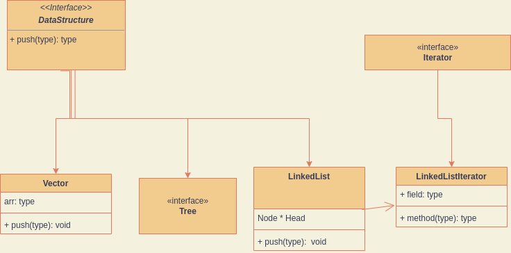

I have some good news and bad news: 

The good is that I have spent some time thinking and learning (since I am currently in the process of preparing for an 
upcoming SDE interview) and this has led me to realize some ways I can improve my current Data Structures project (that I have not 
been working on due to the aforementioned Interview Prep).

The bad is that I will have to refactor my code and remove some of the work I have done. Then again, is this really that bad?

## Problem Summary 

When I initially began my Data Structures project, I wanted to do more than just reimplement Data Structures for the sake of practice:
I wanted to engineer a general Data Structure Solution. That is to say; I wanted to ensure I had a flexible and efficient
solution that could be easily incorporated into further projects should the need arise. 

To achieve this I came up with the following rough UML diagram in my head: 



Part of my inspiration was the ```Collections``` framework of the ```java.util``` package. Essentially: we would define 
a base interface that defines the operations common to all lower data structures, along with any other methods we want 
to be common to each class (eg: createIterator to complete the iterator pattern). 

Having spent some further time working on this project and doing some research, I believe this is no longer the best approach
(for this specific project at least). The reasons for this are the following:

### 1. It violates the 'Liskov Substitution' and 'Interface Segregation' Principles

The following are based on the [SOLID](https://www.freecodecamp.org/news/solid-principles-explained-in-plain-english/) programming principles. 
To summarize what I mean by this: 

#### Liskov Substitution Principle: subclasses should be substitutable for their base classes.

Given that data structures end up being so different from one another, it seems inevitable that this Principle would be violated
at some point. As an example: suppose that we have code that tests an ```append``` function. The pseudocode for 
this code be the following:

```ignorelang
Create data structure
Append some data
Ensure that this data is contained within the datastructure
```

On the surface this code seems like it is okay, but suppose that the data structure we create is a Stack. Stacks should not
implement or expose any append-type method, since then you are not implementing a Stack but rather some type 
of normal LinkedList or Vector. Based on this the above pseudocode would either lead to a run-time failure (cannot call the 
'append' method), lead to a failed test (the function doesn't actually insert any data) or it would mean our data structure
is incorrect.

#### Interface Segregation Principle: many client-specific interfaces are better than one general-purpose interface.

Essentially what I have done is made a general purpose interface (The DataStructure interface). 


## Conclusion

I think the reason I went about things this way and made this mistake was due to 2 reasons:

1. Excitement
2. Over-engineering


Because I was so eager to write code, I let my excitement get the best of me and ignored some of the initial problems that
existed in my code. Further, because I was so excited, I tried to over-engineer a solution and make it more complex than it 
needed to be.

Moving forward I will try and keep things simpler. In the end I'd like to believe that great programmers are programmers 
who solve problems with the least amount of code so that's what I'd like to do in this project. 